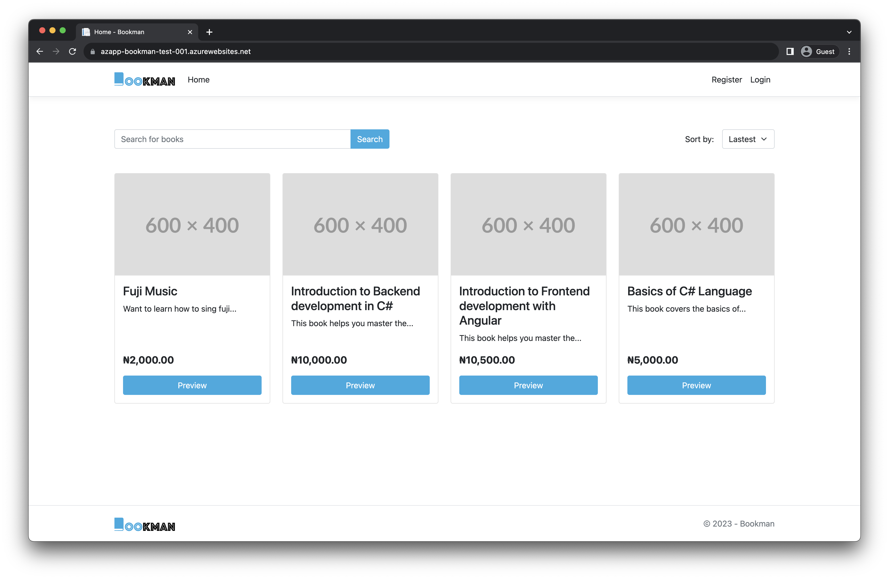
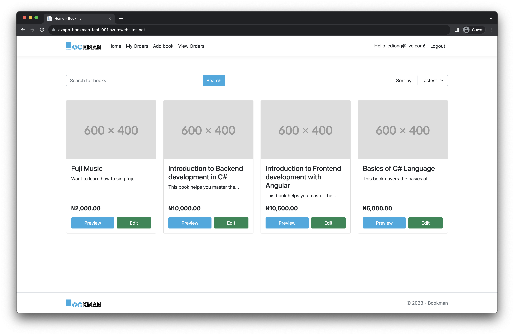
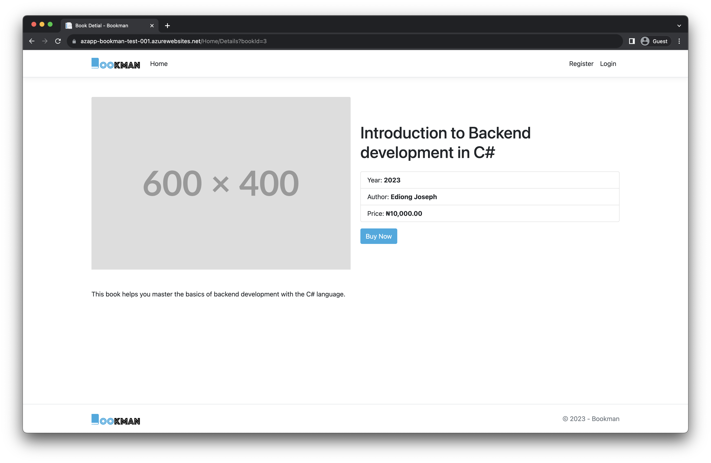

# Bookman

Bookman is an online platform for purchasing the best books in the world. It was built as a final project for my backend development internship with C# at Vnicom Solutions.

## Table of contents

- [Overview](#overview)
  - [The challenge](#the-challenge)
  - [Screenshot](#screenshot)
  - [Links](#links)
- [My process](#my-process)
  - [Built with](#built-with)
  - [What I learned](#what-i-learned)
  - [Continued development](#continued-development)
- [Author](#author)

## Overview

### The challenge

#### All users can:

- View all books
- Search and filter books
- Preview all books

#### Logged in users can:

- Place an order for a book
- View all orders

#### Admin users can:

- Add a new book
- Edit a book
- Grant order for a book

### Screenshot

  

### Links

- Live Site URL: [Bookman-app](https://azapp-bookman-test-001.azurewebsites.net/)

## My process

### Built with

#### Tech Stack

| Purpose  | Stack       |
| -------- | ----------- |
| Backend  | ASP.NET MVC |
| Database | MySQL       |
| ORM      | EF Core     |
| Styling  | Bootstrap   |

#### Infrastructure

| Purpose       | Stack                |
| ------------- | -------------------- |
| App Host      | Azure App Service    |
| Database Host | Azure MySQL Database |

### What I learned

- Hosting Applications on Azure App Service
- Hosting Database on Azure Flexible MySQL Database
- Reporsitory pattern

### Continued development

- Add support for admin to delete a book
- Implement email notification on signup, password reset and deleting book
- Host book images on Azure blob storage
- Store connection string on Azure Key Vault

## Author

- Twitter - [@IEdiong](https://www.twitter.com/IEdiong)
- LinkedIn - [@IEdiong](https://www.linkedin.com/in/IEdiong)
